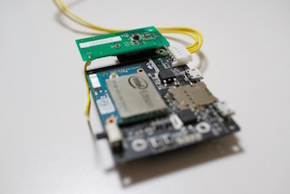
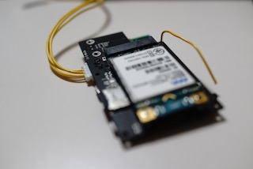

CANDY IoT Board Service
===

[](https://github.com/Robotma-com/candy-iot-service/releases/latest)
[](http://opensource.org/licenses/BSD-3-Clause)

本サービスは、Intel Edison Yocto上で動作するCANDY IoTボードを動作させるためのサービスです。






このサービスでは、以下の機能を提供しています。

- AM Telecom社製LTE/3Gモジュールの自動初期設定(モデム設定とAPN設定)
- AM Telecom社製LTE/3Gモジュールの自動起動
- AM Telecom社製LTE/3Gモジュールを操作するコマンドラインツール
  - APN設定、表示
  - LTE/3Gネットワーク状態表示
  - SIM状態表示
  - モデム情報表示
- Wi-Fi APモード起動時にCANDY IoTボード上でLEDを点滅

また、以下のモジュールは、インストールの可否を選択可能です。 **通常はインストールされます。**
- [CANDY RED](https://github.com/dbaba/candy-red) ... CANDY EGGクラウドサービスに接続可能なNode-REDベースのフローエディターです

# 対応ハードウェア
- Intel Edison

# 対応OS
- Release 2.1 Yocto complete image (poky-yocto)

# 準備するもの
インストールを行う前に以下のものを揃えておきましょう。

1. Intel Edison本体
1. CANDY IoTボード本体
1. CANDY IoT付属のアンテナケーブルとアンテナ本体
1. SIMカード（回線契約が有効であるもの）
1. USBケーブル2本（シリアル通信用と電源供給用）
1. Wi-Fiアクセスポイント（インターネットへ接続できること）

# インストール方法
**インストールには、インターネットに接続できるWi-Fiのアクセスポイントが必要です。**

最初にEdisonをCANDY IoTボードに装着し、SIMカードを装着します。
続いて、CANDY IoTボードにある２つのUSBケーブルをお手持ちのコンピューターに装着します。
つづいてそのコンピューターからEdisonにログインします。
初期状態では、USBシリアルで接続されていますので、シリアルポートを探してターミナルで接続してください。

以下は、OSXやLinuxでの接続例です。ポート名は端末や環境により異なります（例：`/dev/tty.usbserial-DJ00SDKB`、`/dev/ttyUSB1`）。
```bash
$ screen ポート名 115200
```

続いて、Wi-Fiを起動させてください。もしWi-Fiを設定していないときは、`configure-edison --Wi-Fi`にて、Wi−Fiの設定を行ってください。

```bash
Poky (Yocto Project Reference Distro) 1.7.2 binita ttyMFD2

binita login: root
Password:
root@binita:~# ifconfig wlan0 up
```

Wi-Fi起動後、Edisonにてインターネットにアクセスできることを確認してください。
以下のようなcURLコマンドを実行してみましょう。

```bash
$ curl -i -L -X HEAD http://www.candy-line.io/
```

下記のように`HTTP/1.1 200 OK`と出ていれば問題ありません。
```bash
HTTP/1.1 200 OK
Date: Fri, 30 Oct 2015 04:43:43 GMT
Server: Apache
Last-Modified: Mon, 14 Sep 2015 07:08:39 GMT
ETag: "41ed5a-1947-bc184bc0"
Accept-Ranges: bytes
Content-Length: 6471
Content-Type: text/html

curl: (18) transfer closed with 6471 bytes remaining to read
root@binita:~#
```

それでは、GitHub上にあるスクリプトをダウンロードしてインストールします。

以下のコマンドを実行します（`git.io`もGitHubの管理するドメインの1つです）。

```bash
$ curl -L https://git.io/vgKTM | bash
```

[CANDY RED](https://github.com/dbaba/candy-red)を **インストールしない場合** は、以下のように`CANDY_RED=0`を指定します。
```bash
$ curl -L https://git.io/vgKTM | CANDY_RED=0 bash
```

また、特定のバージョンを利用する場合は、以下のようにバージョンを指定することができます。
```bash
$ VERSION=1.5.0 && \
  curl -L https://raw.githubusercontent.com/Robotma-com/candy-iot-service/${VERSION}/install.sh | \
  sudo bash
```

実行すると以下のように表示されます。

    [INFO] cdc_ether has been installed
    [INFO] Installing CANDY RED...
               :
               :
    ln -s '/lib/systemd/system/candy-iot.service' '/etc/systemd/system/multi-user.target.wants/candy-iot.service'
    [INFO] candy-iot service has been installed
    [ALERT] *** Please reboot the system! (enter 'reboot') ***

インストール完了後、上記のようにメッセージが出ますので、以下のコマンドにて再起動させてください。

```bash
$ reboot
```

再起動後、以下のコマンドにて動作状況を確認します。

```bash
$ systemctl status candy-iot
```

以下のように表示されれば正しく動作しています。

    ● candy-iot.service - CANDY IoT Board Service, version:1.6.0
       Loaded: loaded (/lib/systemd/system/candy-iot.service; enabled)
       Active: active (running) since Wed 2016-02-10 03:33:17 UTC; 1min 1s ago
     Main PID: 304 (bash)
       CGroup: /system.slice/candy-iot.service
               ├─304 bash /opt/candy-line/candy-iot/start_systemd.sh
               ├─325 python /opt/candy-line/candy-iot/server_main.py /dev/ttyUSB1 /var/run/candy-iot.sock enp0s17u1
               └─429 udhcpc -i enp0s17u1

    Feb 10 03:33:41 candyred start_systemd.sh[304]: Sending select for 192.168.225.40...
    Feb 10 03:33:41 candyred start_systemd.sh[304]: Lease of 192.168.225.40 obtained, lease time 43200
    Feb 10 03:33:41 candyred start_systemd.sh[304]: /etc/udhcpc.d/50default: Adding DNS 192.168.225.1
    Feb 10 03:33:46 candyred start_systemd.sh[304]: default         192.168.225.1   0.0.0.0         UG    0      0    ...s17u1
    Feb 10 03:33:51 candyred start_systemd.sh[304]: default         192.168.225.1   0.0.0.0         UG    0      0    ...s17u1
    Feb 10 03:33:56 candyred start_systemd.sh[304]: default         192.168.225.1   0.0.0.0         UG    0      0    ...s17u1
    Feb 10 03:34:01 candyred start_systemd.sh[304]: default         192.168.225.1   0.0.0.0         UG    0      0    ...s17u1
    Feb 10 03:34:06 candyred start_systemd.sh[304]: default         192.168.225.1   0.0.0.0         UG    0      0    ...s17u1
    Feb 10 03:34:11 candyred start_systemd.sh[304]: default         192.168.225.1   0.0.0.0         UG    0      0    ...s17u1
    Feb 10 03:34:16 candyred start_systemd.sh[304]: default         192.168.225.1   0.0.0.0         UG    0      0    ...s17u1
    Hint: Some lines were ellipsized, use -l to show in full.

なお上記の`enp0s17u1`が、LTE/3Gモジュールのネットワークインタフェースとなります。

`ifconfig`でネットワークインタフェースの情報を閲覧してみましょう。
```bash
$ ifconfig enp0s17u1
```
以下のように表示されます。

```bash
enp0s17u1 Link encap:Ethernet  HWaddr 99:99:99:99:99:99  
          inet addr:192.168.225.37  Bcast:192.168.225.255  Mask:255.255.255.0
          UP BROADCAST RUNNING MULTICAST  MTU:1500  Metric:1
          RX packets:6 errors:0 dropped:0 overruns:0 frame:0
          TX packets:30 errors:0 dropped:0 overruns:0 carrier:0
          collisions:0 txqueuelen:1000
          RX bytes:768 (768.0 B)  TX bytes:4234 (4.1 KiB)
```

## CANDY REDのインストール確認
CANDY REDは`npmjs.com`経由でインストールされます。時々、このサーバーは`HTTP 400`エラーを返すことがあり、その場合インストールに失敗します。
このエラーはインストール中には気付きにくいため、以下の方法で正しく[CANDY RED](https://github.com/dbaba/candy-red)がインストールされているかを確認しましょう。

    $ systemctl status candy-red

実行後、以下のようになっている場合は、残念ながらインストールされていません。

    ● candy-red.service
       Loaded: not-found (Reason: No such file or directory)
       Active: inactive (dead)

このため、[こちら](#candy-redの追加インストール方法)に記載の方法で追加インストールを行ってください。

## CANDY REDへのブラウザー接続
オプション指定をせずインストールを行うと、[CANDY RED](https://github.com/dbaba/candy-red)が有効になっていますので、ブラウザーから接続してみましょう。Edisonがつながっている無線LANと同じネットワークにあるコンピューターのブラウザーで以下のアドレスを入力してページを表示させてみてください。
```
http://edison.local:8100
```
もしEdisonのホスト名を変更していた場合は、「ホスト名.local」を「edison.local」の代わりに指定します。名前で繋がらないときは、IPアドレスを指定しましょう。

## CANDY REDの追加インストール方法
[CANDY RED](https://github.com/dbaba/candy-red)を後からインストールする場合は、以下のコマンドを実行してください。

    $ systemctl stop candy-iot
    $ npm install -g --unsafe-perm candy-red
    $ systemctl start candy-iot

もし、LTE通信を利用してインストールしたい場合は、前後の`systemctl`コマンドを実行する必要はありません。

# アンインストール方法
アンインストールを行うためには、専用のスクリプトを実行します。このスクリプトは動作中のサービスを停止し、関連ファイルをすべて削除します。

まず`/opt/candy-line/candy-iot/uninstall.sh`を実行します。

```bash
$ cd ~
$ /opt/candy-line/candy-iot/uninstall.sh
```

このコマンドでは、[CANDY RED](https://github.com/dbaba/candy-red)は削除されません。[CANDY RED](https://github.com/dbaba/candy-red)を削除する場合は、後述の「[CANDY REDのアンインストール](#CANDY REDのアンインストール)」をご覧ください。

以下のようにメッセージが出ます。
```bash
[INFO] candy-iot has been uninstalled
[INFO] cdc_ether has been uninstalled
[ALERT] *** Please reboot the system! (enter 'reboot') ***
```

つづいて、上記メッセージの指示通り再起動してください。

```bash
$ reboot
```

再起動後、サービスが削除されたことを確認します。

```bash
$ systemctl status candy-iot
```

以下のように表示されれば成功です。

```bash
● candy-iot.service
   Loaded: not-found (Reason: No such file or directory)
   Active: inactive (dead)
```

削除後は、LTE/3Gモジュールのネットワークインタフェースも見えなくなります。

```bash
$ ifconfig enp0s17u1
```
これを実行しても以下のようにエラーメッセージが表示されます。
```bash
enp0s17u1: error fetching interface information: Device not found
```

## CANDY REDのアンインストール
以下のコマンドを実行すると、[CANDY RED](https://github.com/dbaba/candy-red)を削除することができます。
```bash
$ npm uninstall -g --unsafe-perm candy-red
```

# 自動初期設定

## モデム設定
新規ご購入時など、LTE/3GモジュールがCANDY IoTボード向けの設定になっていない場合があります。
この場合、本サービスが自動的に設定を変更します。この変更が行われるとOSが再起動されます。
通常、初回起動時にこの変更は行われます。

## APN設定
初回インストール時には、USEN向けAPN設定が行われます。
この設定は、後述のコマンドラインツールにより変更することができます。

# コマンドラインツール使用方法
LTE/3Gモジュールの情報を取得したり、設定したりするため、`candy`というコマンドを利用します。
このコマンドは、`/usr/bin`にインストールされるため、インストール完了後（再起動後）にすぐ利用することができます。

## APNの表示
現在設定されているAPNを表示します。パスワードは表示されません。

```bash
$ candy apn ls
{
  "apns": [
    {
      "apn": "umobile.jp",
      "user": "umobile"
    }
  ]
}
```

## APNの設定
APNを設定します。単一のAPNのみ設定することができます。

すでにインターネットに接続できている状態でAPNを変更した場合、変更を反映させるためにはモジュールを再起動する必要があります。
そのような場合は、CANDY IoTボードから電源を外し、再度接続するようにしてください。

```bash
$ candy apn set -n APN名 -u ユーザーID -p パスワード
```

## ネットワーク状態の表示
モバイルネットワークの状態を表示します。Wi-Fiの状態ではありません。
rssiの単位は`dBm`となります。結果文字列の`rssiDesc`には以下の値が入ります。

1. `"OR_LESS"` ... **`rssi`の値以下** であることを示す
1. `"OR_MORE"` ... **`rssi`の値以上** であることを示す
1. `"NO_SIGANL"` ... 圏外
1. `""` ... `rssi`の数値通り

`network`のプロパティは、`ONLINE`、`OFFLINE`または`UNKNOWN`が入ります。

```bash
$ candy network show
{
  "rssi": "-85",
  "network": "ONLINE",
  "rssiDesc": ""
}
```

## SIM状態の表示
SIMの状態を表示します。
結果文字列の`state`には、以下の文字列が入ります。

1. `SIM_STATE_READY` ... SIMが認識されている
1. `SIM_STATE_ABSENT` ... SIMが認識されていない

```bash
$ candy sim show
{
  "msisdn": "11111111111",
  "state": "SIM_STATE_READY",
  "imsi": "440111111111111"
}
```

## モデム状態の表示
モデム状態を表示します。

```bash
$ candy modem show
{
  "imei": "999999999999999",
  "model": "AMP5200",
  "manufacturer": "AM Telecom",
  "revision": "14-01"
}
```

# 管理者向け
## モジュールリリース時の注意

1. [`install.sh`](/install.sh)内の`VERSION=`にあるバージョンを修正してコミットする
1. 履歴を追記、修正してコミットする
1. （もし必要があれば）パッケージング
```bash
$ ./install.sh pack
```

## 開発用インストール動作確認
```bash
$ VERSION=1.6.1 && mkdir tmp && cd tmp && tar zxf ~/candy-iot-service-${VERSION}.tgz
$ time SRC_DIR=$(pwd) DEBUG=1 ./install.sh
```

# 履歴
* 1.7.0
  - コマンド名を`candy`に変更

* 1.6.1
  - コマンド受付ソケットバックログを128に増加

* 1.6.0
  - CANDY REDをデフォルトで追加インストールする機能を追加（`CANDY_RED=0`で抑止可能）

* 1.5.0
  - AM Telecom社製LTE/3Gモジュールの自動初期設定(モデム設定とAPN設定)を追加

* 1.4.0
  - このサービスのソフトウェアバージョンを表示するコマンドを追加
  - 製品名の表記方法を変更
  - バージョン指定を一箇所に集約

* 1.3.1
  - AM Telecomモジュールモデムのウェイト時間が短いため、一部のコマンドについてモデムが応答を返す前に結果を諦めていたため、ウェイト時間を延長

* 1.3.0
  - AM TelecomモジュールへのAPN設定機能、SIM情報表示機能、モバイルネットワーク状態表示機能、モデム情報表示機能を追加
  - ドキュメントの表現を変更

* 1.2.0
  - Wi-Fi APモード動作時のLED点滅をCANDY IoTボードのLED(GPIO 14)でも点滅するように変更

* 1.1.0
  - Dockerコンテナー内で動作させるため、`KERNEL`の指定を行える機能を追加（例：`KERNEL=3.10.17-poky-edison+`）
  - インストール時のモジュールコピー先をファイルに出力できる機能を追加

* 1.0.1
  - デフォルトゲートウェイの設定が起動時に正しく行われない問題を修正

* 1.0.0
  - [AM Telecom社製LTE/3GモジュールAMP5200/AMP5220](http://www.amtel.co.jp/english/product/list?category=1020)に対応
